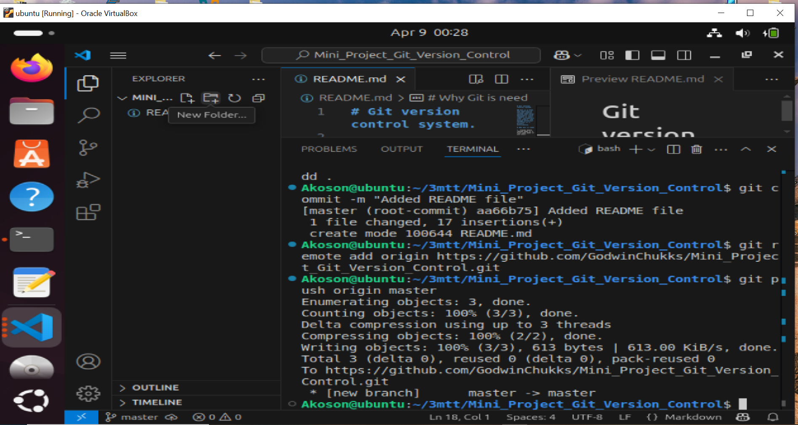
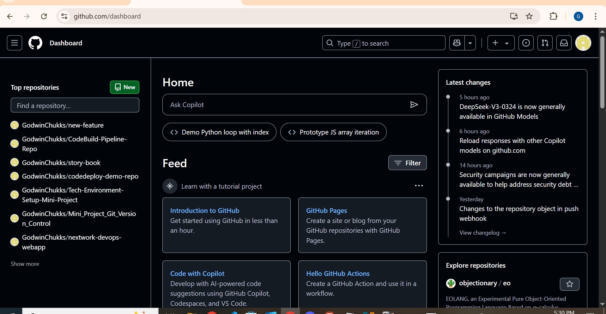

# Git version control system.

## Git is a free and open-source version control system that helps developers track changes in their code, collaborate with others, and manage different versions of a project efficiently.

# Why Git is need

1. Tracks every change made to a file (who made it and when)

2. Prevents accidental code loss

3. Enables smooth collaboration on projects

4. Supports remote backups using platforms like GitHub, GitLab, or Bitbucket

5. Helps in debugging by comparing previous working versions

6. Git helps you stay organized, collaborate confidently, and never lose your work — it's an essential tool for any developer

# Terminal Screenshot

# Github Dashboard

# Github Repository url

[Github Repository url](https://github.com/GodwinChukks/Mini_Project_Git_Version_Control)

